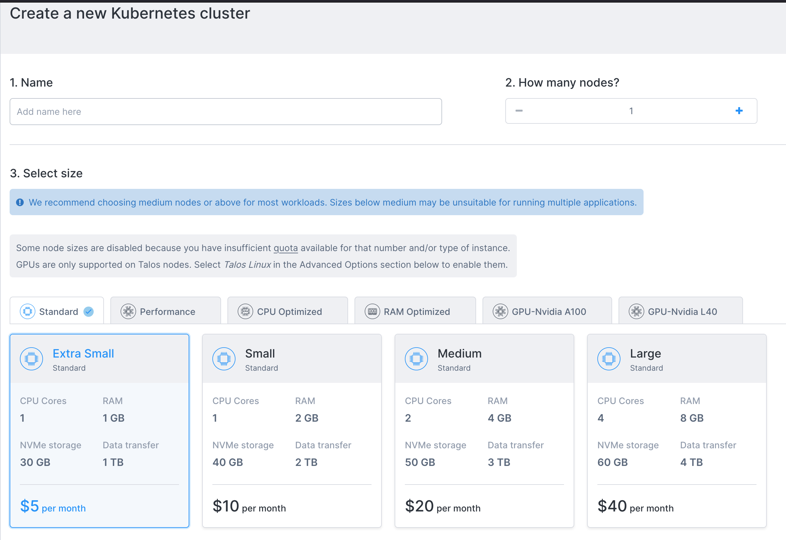

# A Walkthrough - Deploying A React App to $5 Kubernetes Cluster

This repo holds the steps we perform on the stream:

https://www.linkedin.com/events/awalkthrough-deployingareactapp7160557073028530176/comments/

## Create a cluster



- https://civo.com
- single node, "Small" $10
- "Kubeconfig: Click to download"

## Tooling prerequesite

### `kubectl`

https://kubernetes.io/docs/tasks/tools/

### `helm`

https://helm.sh/docs/intro/install/

## Verify connection

```bash

$ export KUBECONFIG=~/Downloads/civo-walkthrough-kubeconfig 
$ kubectl get nodes

NAME                                               STATUS   ROLES    AGE     VERSION
k3s-walkthrough-7efb-f0795d-node-pool-469b-u5hof   Ready    <none>   6m53s   v1.26.4+k3s1

$ kubectl get pods -A

NAMESPACE     NAME                                 READY   STATUS      RESTARTS   AGE
kube-system   civo-ccm-db67548d-mqk4x              1/1     Running     0          11m
kube-system   coredns-59b4f5bbd5-mpgkv             1/1     Running     0          11m
kube-system   metrics-server-7b67f64457-nmgnw      1/1     Running     0          11m
kube-system   civo-csi-node-j8gpr                  2/2     Running     0          10m
kube-system   civo-csi-controller-0                4/4     Running     0          11m
default       install-traefik2-nodeport-wa-6hrzs   0/1     Completed   0          10m
kube-system   traefik-lxxd7                        1/1     Running     0          9m45s

$ kubectl top nodes

NAME                                               CPU(cores)   CPU%   MEMORY(bytes)   MEMORY%   
k3s-walkthrough-7efb-f0795d-node-pool-469b-u5hof   50m          6%     420Mi           97% 
```

## Deploying a React app

### Create a file with the build commands:

```yaml
#values.yaml
gitCloneUrl: https://github.com/laszlocph/reactjs-test-app.git
buildImage: "node:20.10-buster"
buildScript: npm install && npm run build
builtAssets: build/
```

### Deploy the manifests

```bash
$ helm repo add onechart https://chart.onechart.dev
$ helm template my-react-site onechart/static-site -f values.yaml > manifest.yaml

$ kubectl apply -f manifest.yaml

service/my-react-site created
deployment.apps/my-react-site created

$ kubectl get pods

NAME                                 READY   STATUS      RESTARTS   AGE
install-traefik2-nodeport-wa-6hrzs   0/1     Completed   0          16m
my-react-site-7687bfc5fc-gc6k5       0/1     Init:0/1    0          17s
```

https://gimlet.io/docs/onechart-reference

### Verify build

#### First the container image is pulled and started

```bash
$ kubectl describe pod my-react-site-7687bfc5fc-gc6k5

...
  Normal  Pulling    98s   kubelet            Pulling image "node:20.10-buster"
```

#### Then the build is running in an init container

```bash
$ kubectl get pods

NAME                                 READY   STATUS      RESTARTS   AGE
install-traefik2-nodeport-wa-6hrzs   0/1     Completed   0          16m
my-react-site-7687bfc5fc-gc6k5       0/1     Init:0/1    0          17s
```

```bash
$ kubectl get pods

NAME                                 READY   STATUS      RESTARTS   AGE
install-traefik2-nodeport-wa-6hrzs   0/1     Completed   0          16m
my-react-site-7687bfc5fc-gc6k5       0/1     Init:0/1    0          17s
```

```bash
$ kubectl logs -f my-react-site-7687bfc5fc-gc6k5 -c init-con
Cloning into 'reactjs-test-app'...


npm WARN deprecated stable@0.1.8: Modern JS already guarantees Array#sort() is a stable sort, so this library is deprecated. See the compatibility table on MDN: https://developer.mozilla.org/en-US/docs/Web/JavaScript/Reference/Global_Objects/Array/sort#browser_compatibility
npm WARN deprecated w3c-hr-time@1.0.2: Use your platform's native performance.now() and performance.timeOrigin.
npm WARN deprecated sourcemap-codec@1.4.8: Please use @jridgewell/sourcemap-codec instead
npm WARN deprecated rollup-plugin-terser@7.0.2: This package has been deprecated and is no longer maintained. Please use @rollup/plugin-terser
npm WARN deprecated workbox-cacheable-response@6.6.0: workbox-background-sync@6.6.0
npm WARN deprecated svgo@1.3.2: This SVGO version is no longer supported. Upgrade to v2.x.x.
```

### Open a port-forward

```bash
$ kubectl port-forward svc/my-react-site 8000:80

Forwarding from 127.0.0.1:8000 -> 80
Forwarding from [::1]:8000 -> 80
Handling connection for 8000
```

### Open on a domain name

- Locate the cluster DNS name: 58ae998a-001d-4ce2-a7f2-a27b84f73afc.k8s.civo.com
- Edit the deployment manifest

```diff
#values.yaml
gitCloneUrl: https://github.com/laszlocph/reactjs-test-app.git
buildImage: "node:20.10-buster"
buildScript: npm install && npm run build
builtAssets: build/

+ ingress:
+   annotations:
+     kubernetes.io/ingress.class: traefik
+  host: 58ae998a-001d-4ce2-a7f2-a27b84f73afc.k8s.civo.com
```

## Using a private git repository

- Create a Kubernetes secret with a Github (fine-grained) personal access token (PAT)

```bash
export PAT=github_pat_xxxx
export GITHUB_URL_WITH_PAT=https://$PAT@github.com/laszlocph/reactjs-test-app-private.git

kubectl create secret generic git-creds --from-literal=gitCloneUrl=$GITHUB_URL_WITH_PAT
```

- Reference the secret to provide the github clone url

```diff
#values.yaml
- gitCloneUrl: https://github.com/laszlocph/reactjs-test-app.git
+ gitCloneUrlSecretName: git-creds
buildImage: "node:20.10-buster"
buildScript: npm install && npm run build
builtAssets: build/
```

```bash
helm template my-react-site onechart/static-site -f values.yaml | kubectl apply -f -
```

## Deploying multiple sites

- Deploy another site
- With a DNS CNAME pointing to the CIVO DNS name

```yaml
gitCloneUrl: https://github.com/laszlocph/reactjs-test-app.git
buildImage: "node:20.10-buster"
buildScript: npm install && npm run build
builtAssets: build/

ingress:
  annotations:
    kubernetes.io/ingress.class: traefik
  host: walkthrough.turbopizza.net
```

## HTTPS

- Use Cloudflare to proxy traffic
- Use Cert-Manager Helm chart (out of scope)

## Deploying to a $5 cluster

### Build container image locally

```bash
$ docker build -t ttl.sh/my-react-site-from-image:1d . --platform=linux/amd64

$ docker run --rm -it -p 8000:80 ttl.sh/my-react-site-from-image:1d
```

`.Dockerignore` file is vital if you have `.env` files 

### Push container image to container registry

https://github.com/replicatedhq/ttl.sh

```bash
docker push ttl.sh/my-react-site-from-image:1d
```

For production use Docker Hub. Public images are free.

### Reference the container image from the deployment manifest

```yaml
# values.yaml
image:
  repository: ttl.sh/my-react-site-from-image
  tag: 1d
  pullPolicy: Always

resources:
  ignore: true
```

```bash
$ helm repo add onechart https://chart.onechart.dev
$ helm template my-react-site-from-image onechart/onechart -f values3.yaml > manifest3.yaml

$ kubectl apply -f manifest3.yaml

$ kubectl port-forward svc/my-react-site-from-image 8000:80
```
